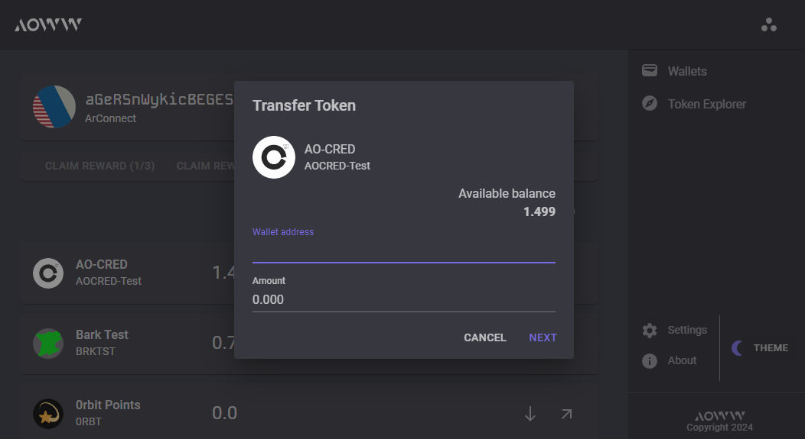

# aoWebWallet
Arweave ao Web Wallet

Try it now: https://aoww.net

## What is ao Web Wallet?
ao Web Wallet is a wallet for the [ao network](https://ao.arweave.dev) running on Arweave. On ao it's easy to create earn some tokens when compliting a quest or create your own token. This wallet gives you an easy way to receive and transfer those tokens.

Features:
- Add ArConnect Wallets
- Create new wallets and import wallet.json files
- View your ao processes
- Send tokens for your owned ao processes
- View balances of a wallet
- View all transactions for a wallet
- Add custom tokens
- Dark and Light theme

**Explorer**  
ao Web Wallet is also an explorer for the tokens on the ao netwerk. 
- View transactions
- Inspect the balances of any address
- View all transactions for a token

## Hack the Weave Hackathon
This project was created for the [Hack the Weave](https://www.weaversofficial.com/hackathon-learn-more) hackathon.

## Tech
This project is build with C#, using the Blazor framework and compiled to WebAssembly. Compiling to WebAssembly results in an application that only contains static files that can be hosted anywhere, also on Arweave!

## Screenshots
Start

Wallets

Balances and Transactions

Transfer Tokens

Token Explorer

## Install for local development

Install:
- Install .Net 8: https://dotnet.microsoft.com/en-us/download
- Navigate to directory: `src\aoWebWallet`
- Restore dependencies: `dotnet restore`
- Build: `dotnet build`

Run:
- Navigate to directory: `src\aoWebWallet`
- Start the app: `dotnet watch` (for hot reloading support) or `dotnet run`
- Now listening on: http://localhost:35441/

## Credits
* [Michiel Post](http://www.michielpost.nl) ([@michielpostnl](https://twitter.com/michielpostnl)) - tech and development
* [Nuno Lopes](https://github.com/lopezi) ([@2n1u0](https://twitter.com/2n1u0)) - design and frontend

## Donations
Happy with this application? Donations help fund the further development. Donations can go to: zsXSvJtHVSK4QyPch4Uf0JMiZi9uEhgVvyz6qeEJcfY

## Open source credits
[MudBlazor Components](https://mudblazor.com/) - UI Components

